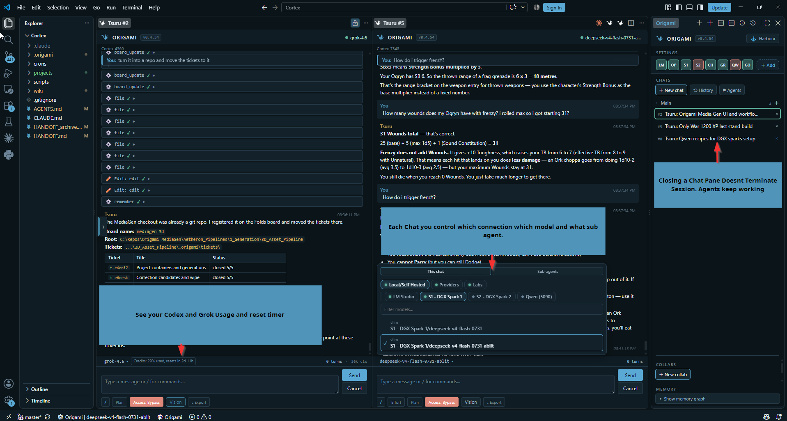
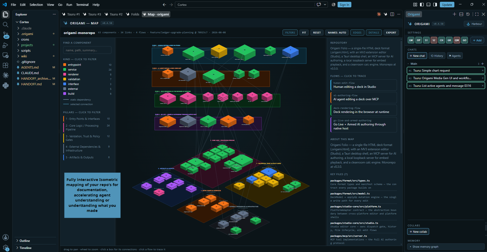
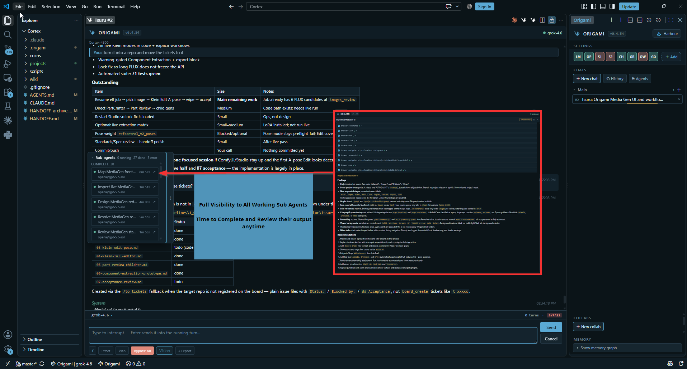
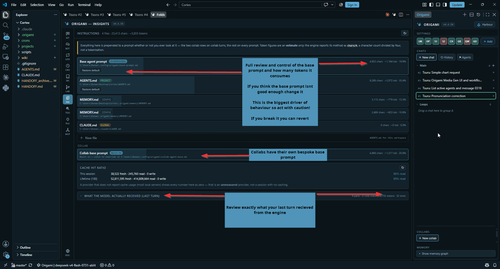
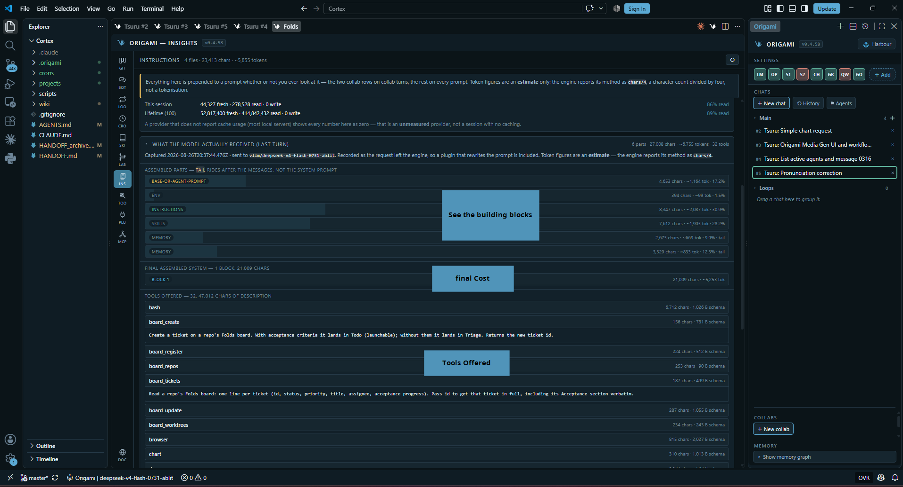
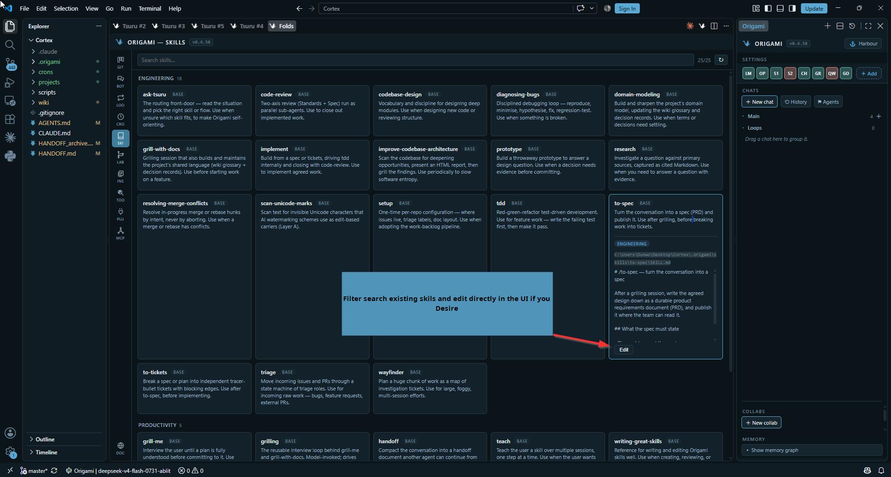
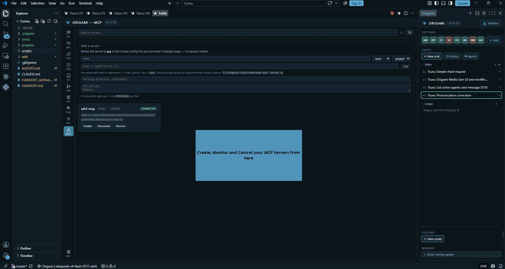
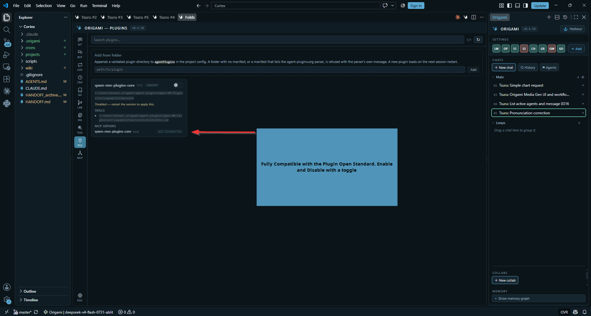
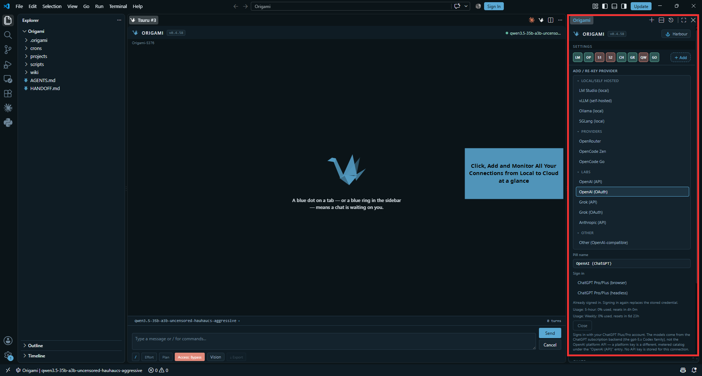
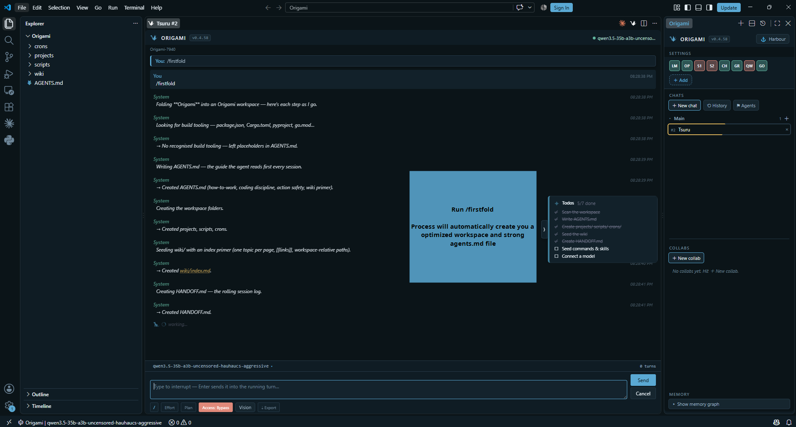

  

<h1 align="center">Origami Coder</h1>

<b>The Best VS Code AI Harness</b>

  
  
  

  🌐 <a href="https://origamilabs.nl">Website</a> •
  📖 <a href="https://origamilabs.nl/docs.html">Docs</a> •
  🧩 <a href="https://marketplace.visualstudio.com/items?itemName=OrigamiLabs.origami-coder-vscode">Marketplace</a>

---

This harness is built from the ground up on the following foundations:

| | |
|---|---|
| **VS Code First** | If you're into TUIs or Electron wrappers, it's not for you. |
| **Privacy & Local** | No ads, no telemetry, no trying to sell you a service. |
| **As simple as you need it as complex as you want it** | Open a chat and get building — but within the UI you have deep analytics and levers to make it yours. |

## Features

### Multiple Chats, Multiple Models, Full Control

- Every chat picks its own connection, model and sub-agent from a single dropdown.
- Local, self-hosted servers, providers and lab APIs all sit in the same list.
- Signed-in accounts show their credit use and reset timer under the composer.
- Closing a chat pane does not end the session -> the agent keeps working.

### Charts in the thread, and agents that talk to each other

- Have alot of data to review? Have your Model make a chart of it in chat
- Each session can see one another and send each other messages
- Great for handovers, sub contracting work to cheaper models and larger collaborations
- It picks the work up on its next turn. A model with no vision of its own can be handed a vision sub-agent.

### Nothing hidden, and a session that closes properly

- Every action and every thought stream is on the record (collapsed by default)
- Open when you want to audit a turn.
- The todo pane tracks the agent's plan as it moves.
- Tell it to wrap the session and it writes the handoff and the wiki depth, so the next session starts already knowing where you left off.

### A memory graph, not a second app

- Your workspace knowledge base drawn as a graph.
- Filter the nodes, hover to light up the links, click one to read the page inline with its tags and date.
- Nothing else to install and nothing to sync.

### Folds — a board per repo, an agent per worktree

- Spec a ticket, launch an agent on it, and that agent works in its own isolated git worktree.
- Your working tree stays untouched
- You review the diff and apply it on your command, never before.
- Any local git repo can go on the board, and you switch checkouts and branches from the same screen.

### Repo maps you can walk through

- Remap a repo and Origami draws it
- Components by kind, the pillars they belong to, and the flows that cross them -> pan, zoom, filter, click a box for its connections or a flow to trace it end to end.
- Key files come with a line of summary each. It is built for both readers: you, and the agent that needs to orient before it touches the code.

### Sub-agents you can actually watch

- Delegated work gets its own list —> running, done, errored
- See the model and the wall time for each one.
- Open any of them and read the full transcript with its findings, during the run or long after it finished.

### Bots built to your spec

- Define your own bots -> a name, a model, a tool set, a memory setting and a step budget.
- Each one runs in three places —> its own chat, a collab room, or as a sub-agent
- And any of them can be marked as a vision agent for when you need a spare pair of eyes.

### Loops

- Start one from the composer with `/loop <interval> <prompt>` and it re-runs on that interval.
- Loops survive a window reload —> each re-arms itself when its chat reconnects, 
- Want to end a loop but come back later? mark it as persistent and it stays there dormant, waiting.

### Crons — scheduled runs with the editor closed

- A cron is a real OS scheduled task, it fires with VS Code closed, unlike a Loop.
- See every job and when it next runs, and pick the connection and model each one calls.
- Schedules live in .origami/crons.json, tracked in git (git is the undo.)

### A browser the agent can drive

- Fully ocmpatible with the integrated browser -- opens a URL or a local page, reads it and clicks through it
- Permissioned in case you dont want it
- Point it at your own dev server and the agent can check its own work.
- Every chat exports from the composer, so a session can be handed to anything.

### Insights — see what the model is actually fed

- Every file that gets prepended to your prompt, with its character count, its token estimate and its share of the total.
- Override the base prompt, restore the default, or add your own file.
- Cache hit ratio for the session and across the last hundred runs sits right underneath.

### Insights — the assembled payload, part by part

- Expand the last turn and see exactly what left the engine: each assembled part with its size, which ones ride as a tail after the messages, the final system block, and every tool schema offered with the characters it spends.

### Labyrinth — where the tokens went

- Labyrinth indexes every run: tokens in and out, raw against real after cache, cache read against write, and spend split both by category and by delegated sub-run.
- Three views of the map, an inspector for any step, and the whole thing exports to HTML.

### Skills

- Skills are markdown files the agent loads when the task calls for one. -  Search the installed set, read what each does, and edit any of them in place without leaving the pane.

### Tools, and the context they cost

- Every tool sits in one of three states: Loaded :  so its schema goes out with every request;  Deferred : so it costs one catalog line until the model searches for it; Off : Session never sees it, no context as if it never existed. 
- Scaffold a new tool from the built-in template, and turn on code mode to let the model reach several tools from one script.

### MCP servers from the UI

- Add a server from the pane and it is written to the config you choose and connected straight away, with no session restart.
- Disable, disconnect or remove it from the same card.

### Plugins

- Plugins follow the open agent-plugins standard: 
- Point at a folder and a valid manifest brings its skills and its MCP servers along with it.
- A manifest that does not parse is refused with the parser's own message. 
- Toggle a plugin off without deleting it.

### Plays well with your other assistant

- Origami is a side panel and a set of editor tabs, not a takeover of your window.
- Claude Code can sit right next to it in the same workspace 
- Same files, same repo, your call which one gets the job.

## Getting started

1. Install Origami Coder from the VS Code Marketplace.
2. Open it from the activity bar — the crane icon — and the panel docks on the right.
3. Add a connection. Pick a local or self-hosted server, a provider, or a lab account, then paste a key or sign in. Everything you have connected stays visible in one list, with usage and reset timers where the provider reports them.

   

4. Run /firstfold in a new chat. It scans the workspace, writes an AGENTS.md your agent reads every session, creates the project folders, seeds a wiki index and starts a rolling HANDOFF.md — narrating each step as it goes.

   

5. Start working. Chat as you are, or open the Folds board, add a repo and launch your first fold.

## Support the project

Origami Coder is free, has no ads and sells you nothing. If it saves you time, you can throw something in the tin.

## License

Free to use; not for resale, and not for resale as an adaptation — see [LICENSE](https://github.com/PassingByPixels/Origami-Coder/blob/master/LICENSE.txt).
